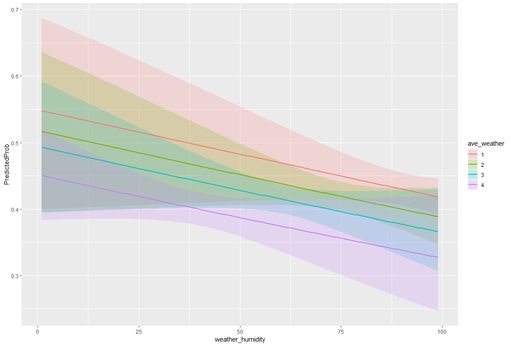
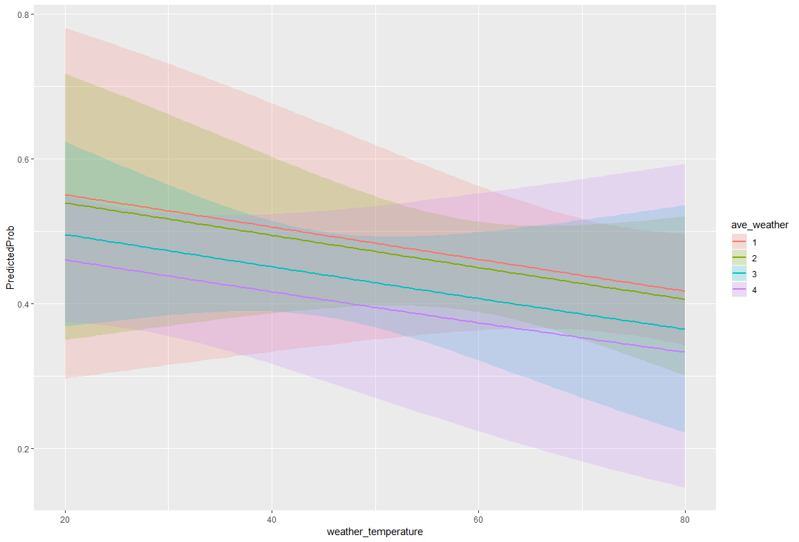
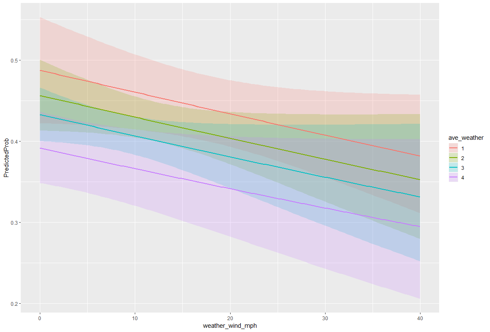

# 201-final-project
Final project of the best group in au18 info 201 Section A. 

Team: Lucas Tucker, Josh Manning, Eric Cohen, Daniel In

Link to project: 

## Images of proof of low correlation in weather algorithm

"The code to generate the predicted probabilities (the first line below) is the same as before, 
except we are also going to ask for standard errors so we can plot a confidence interval. 
We get the estimates on the link scale and back transform both the predicted values and 
confidence limits into probabilities." - https://stats.idre.ucla.edu/r/dae/logit-regression/

Key: 

Rank | Stadium

   1   |   warm
 
   2   | moderate
 
   3   |   dome
 
   4   |   cold
  
  
  
Each Rank is broken up based on the normal distribution of the total of each feature; temperature, humidity, and wind_mph.
Each rank is a different quartile, 4 being the first quartile and 1 being the fourth. The distribution can be found below:

Min. | 54.0

1st Qu.  |   116.0

Median   |   134.0  

Mean     |  132.2 

3rd Qu.  |   149.0

Max.     |  192.0

NA's     |  3284

